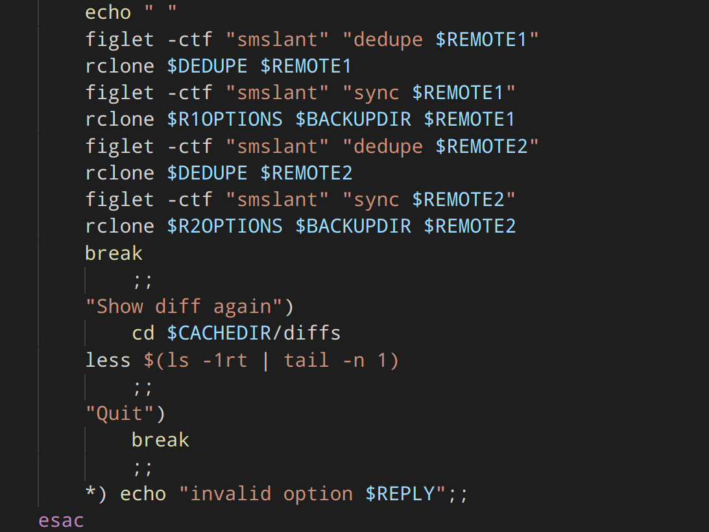

# Cloud Diff Backup
Rclone backup script which shows local changes first

## Project Goal.
A fast bash-based locally generated summary of changes on your local file-system since the last backup.

### Use Case
I looked into severalcloud-based command line backup utilities, but I didn't like any of them for my purposes. What I want is a one way rclone from a local directory to a remote for multiple remotes.what I want to avoid is rclone sync deleting a bunch of files because of failure of a local Drive in my drive pool which are cologne backs up from. I want a quick summary of changes on the local filesystem shown to me so I can review what will be pushed up to the remote. Then I can perform a sanity-check and let my backup scripts run if everything looks good. rclone sync support the --dry-run option, but this takes to long to display. I also want to manipulate the summary output myself to sort results into sections and provide additional summary data (eg. number of files). Because of this, I have written this bash script as a wrapper around my custom rclone commands to show the user a summary of changes on the file system and allow the user to decide whether to sync.

## supports
- creates directories if needed
- user customizable directories
- generates list of files and shows changes
- automatically cleans up old files

## needs
- [ ] display a formatted textfile instead of the diff. summary.txt
- [ ] Section 1: should have old files number vs new files number
- [ ] Section 1: then should show difference (eg. 5 more files, 5 fewer files)
- [ ] Section 2: new files: cut out > files and list in this section
- [ ] Section 3: new files: cut out < files and list in this section
- [ ] Section 4: moved files?: compare < and > files and if its the same filename but a different file path, move it to this section.

    - top should be old files number vs new files number
    - next section should be new files
